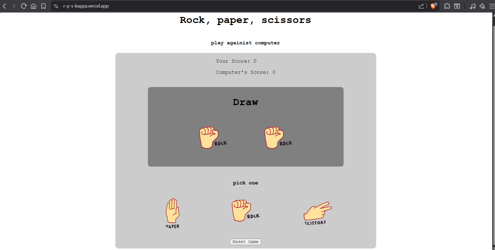
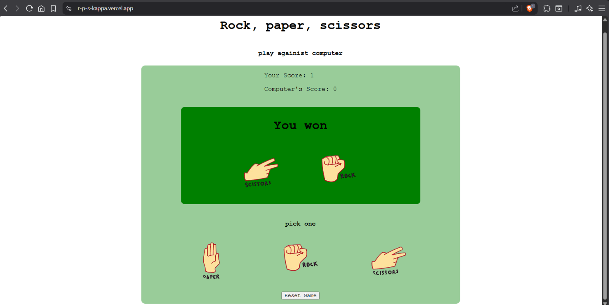
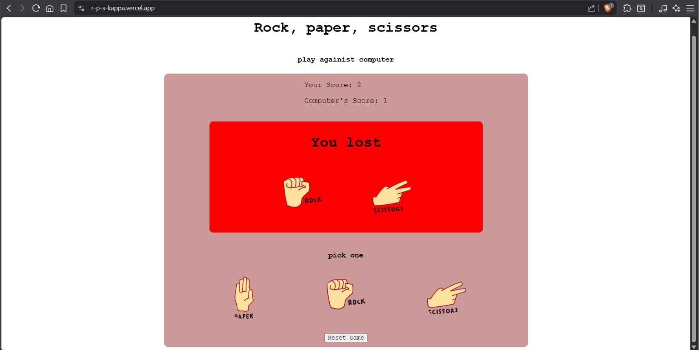

## Rock, paper, and scissors

[](https://horizons.hackclub.com/)

That game that we all played when we were child(I am still playing it till now(I am 15)):
- Rock beats scissors
- Paper beats paper
- Scissors beats paper

## Languages used:
- HTML
- CSS
- JavaScript

## How does it work??
Game logic mainly depends on if and else.

### Fun fact:

I got tired of searching why `You won`, `You lost`, and `Draw` doesn't appear when I win, lose ,or even draw. Until I found that I putted `letsStartText.textContent = "Let's start";` and `letsStartText.textContent = "You won";`. I made that THE BOTH  appear when I win or lose,or even draw, so the script confuses and make `Let's start` only appears.

## Installation
No installation required just use live demo

## Live Demo:
> [Live Demo](https://r-p-s-kappa.vercel.app/)

## 📸 Screenshots:





## AI Declaration:
AI wasn't used to write code. It was used sometimes to findout errors and explain how to make the randomization system:
```    
    const randomizeloop = setInterval(() => {
        const choice = Math.floor(Math.random() * e5tyaratlength);
        computerimg.src = e5tyarat[choice];
        computerPick = choiceMap[e5tyarat[choice]];
    }, 150);
